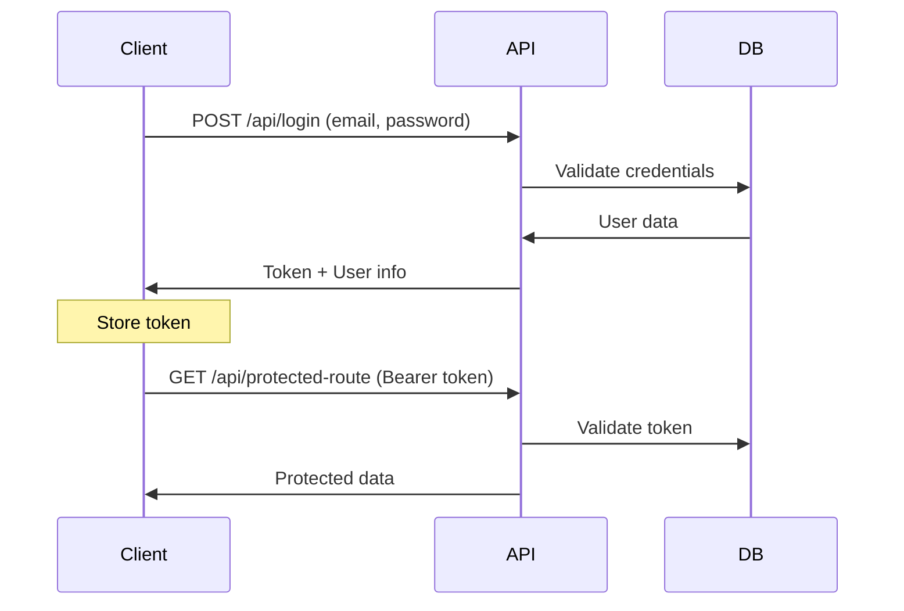
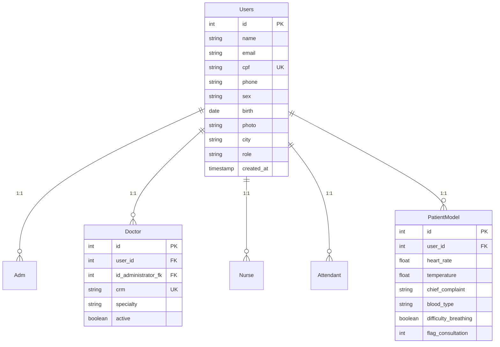

# 🏥 AtendeBem - Sistema de Pronto Socorro

<div align="center">


[](https://github.com/MLS467/Projeto_DBII_Laravel)
[](https://github.com/MLS467/Projeto_DBII_Laravel)
[](https://php.net)
[](https://laravel.com)

**Sistema completo de gerenciamento hospitalar com autenticação segura, CRUD completo e testes automatizados.**

</div>

---

## 📋 **Índice**

-   [📖 Sobre o Projeto](#-sobre-o-projeto)
-   [🏗️ Arquitetura](#️-arquitetura)
-   [🚀 Instalação](#-instalação)
-   [⚙️ Configuração](#️-configuração)
-   [🔐 Autenticação](#-autenticação)
-   [📡 API Endpoints](#-api-endpoints)
-   [🧪 Testes](#-testes)
-   [📊 Banco de Dados](#-banco-de-dados)
-   [🎥 Demonstrações](#-demonstrações)
-   [👥 Contribuição](#-contribuição)

---

## 📖 **Sobre o Projeto**

O **AtendeBem** é um sistema completo de gerenciamento para pronto socorro, desenvolvido com **Laravel 11** e seguindo as melhores práticas de desenvolvimento. O sistema oferece:

### **Principais Funcionalidades:**

-   🔐 **Autenticação segura** com Laravel Sanctum
-   👥 **Gestão completa** de usuários (Administradores, Atendentes, Médicos, Enfermeiros, Pacientes)
-   📋 **CRUD completo** para todas as entidades
-   🏥 **Gestão de consultas** e prontuários médicos
-   📊 **Dashboard** com métricas em tempo real
-   🧪 **Testes automatizados** com 100% de sucesso
-   🔄 **API RESTful** bem documentada

### **Tecnologias Utilizadas:**

-   **Framework:** Laravel 11.x
-   **Autenticação:** Laravel Sanctum (API Tokens)
-   **Banco de Dados:** MySQL
-   **Testes:** PHPUnit + Pest
-   **Documentação:** Swagger/OpenAPI (em desenvolvimento)

---

## 🏗️ **Arquitetura**

O sistema segue uma arquitetura MVC limpa com separação de responsabilidades:

```
app/
├── 📁 Http/Controllers/Api/     # Controllers organizados por domínio
│   ├── Auth/                    # Autenticação (Login/Logout)
│   ├── Patient/                 # Gestão de pacientes
│   ├── Doctor/                  # Gestão de médicos
│   ├── Nurse/                   # Gestão de enfermeiros
│   ├── Attendant/              # Gestão de atendentes
│   └── Dashboard/              # Métricas e relatórios
├── 📁 Models/                   # Modelos Eloquent
├── 📁 Requests/                # Form Requests para validação
├── 📁 Resources/               # API Resources para transformação
├── 📁 Exceptions/              # Exceções customizadas
└── 📁 Policies/                # Policies para autorização
```

### **Padrões Implementados:**

-   ✅ **Repository Pattern** (Controller abstrato CRUD)
-   ✅ **Form Request Validation**
-   ✅ **API Resources** para padronização de respostas
-   ✅ **Exception Handling** customizado
-   ✅ **Policy-based Authorization**

---

## 🚀 **Instalação**

### **Pré-requisitos:**

-   PHP 8.0 ou superior
-   Composer
-   MySQL 5.7 ou superior
-   Node.js (opcional, para assets)

### **Passo a passo:**

```bash
# 1. Clone o repositório
git clone https://github.com/MLS467/Projeto_DBII_Laravel.git
cd Projeto_DBII_Laravel

# 2. Instale as dependências
composer install

# 3. Configure o ambiente
cp .env.example .env

# 4. Gere a chave da aplicação
php artisan key:generate

# 5. Configure o banco de dados no .env

# 6. Execute as migrations
php artisan migrate

# 7. Popule o banco (opcional)
php artisan db:seed

# 8. Inicie o servidor
php artisan serve
```

---

## ⚙️ **Configuração**

### **Variáveis de Ambiente Principais:**

```env
# Aplicação
APP_NAME=AtendeBem
APP_ENV=local
APP_DEBUG=true
APP_URL=http://localhost:8000

# Banco de Dados
DB_CONNECTION=mysql
DB_HOST=127.0.0.1
DB_PORT=3306
DB_DATABASE=atendem_bem
DB_USERNAME=seu_usuario
DB_PASSWORD=sua_senha

# Laravel Sanctum
SANCTUM_STATEFUL_DOMAINS=localhost:3000,127.0.0.1:3000
```

### **Configurações de Produção:**

-   Configure `APP_DEBUG=false`
-   Use HTTPS (`APP_URL=https://...`)
-   Configure cache Redis (recomendado)
-   Ative compressão de arquivos estáticos

---

## 🔐 **Autenticação**

O sistema utiliza **Laravel Sanctum** para autenticação baseada em tokens.

### **Fluxo de Autenticação:**



### **Exemplo de uso:**

```javascript
// Login
const response = await fetch("/api/login", {
    method: "POST",
    headers: {
        "Content-Type": "application/json",
    },
    body: JSON.stringify({
        email: "admin@example.com",
        password: "password",
    }),
});

const { token, user } = await response.json();

// Requisições autenticadas
fetch("/api/patients", {
    headers: {
        Authorization: `Bearer ${token}`,
        Accept: "application/json",
    },
});
```

---

## 📡 **API Endpoints**

### **Autenticação**

| Método | Endpoint             | Descrição         |
| ------ | -------------------- | ----------------- |
| `POST` | `/api/login`         | Login do usuário  |
| `GET`  | `/api/logout/{user}` | Logout do usuário |

### **Dashboard**

| Método | Endpoint         | Descrição           |
| ------ | ---------------- | ------------------- |
| `GET`  | `/api/dashboard` | Métricas do sistema |

### **Gestão de Usuários**

| Método   | Endpoint        | Descrição                |
| -------- | --------------- | ------------------------ |
| `GET`    | `/api/adm`      | Listar administradores   |
| `POST`   | `/api/adm`      | Criar administrador      |
| `GET`    | `/api/adm/{id}` | Visualizar administrador |
| `PUT`    | `/api/adm/{id}` | Atualizar administrador  |
| `DELETE` | `/api/adm/{id}` | Excluir administrador    |

### **Pacientes**

| Método   | Endpoint                    | Descrição           |
| -------- | --------------------------- | ------------------- |
| `GET`    | `/api/patient`              | Listar pacientes    |
| `POST`   | `/api/patient`              | Criar paciente      |
| `GET`    | `/api/patient/{patient}`    | Visualizar paciente |
| `PUT`    | `/api/patient/{patient}`    | Atualizar paciente  |
| `DELETE` | `/api/patient/{patient}`    | Excluir paciente    |
| `GET`    | `/api/patient/search/{cpf}` | Buscar por CPF      |

### **Médicos, Enfermeiros e Atendentes**

Seguem o mesmo padrão CRUD dos endpoints acima, substituindo a rota base:

-   `/api/doctor` - Médicos
-   `/api/nurse` - Enfermeiros
-   `/api/attendant` - Atendentes

### **Consultas e Prontuários**

| Método | Endpoint             | Descrição           |
| ------ | -------------------- | ------------------- |
| `GET`  | `/api/consultation`  | Listar consultas    |
| `POST` | `/api/consultation`  | Criar consulta      |
| `GET`  | `/api/records/{cpf}` | Prontuários por CPF |

---

## 🧪 **Testes**

O projeto possui uma suíte completa de testes automatizados:

### **Estatísticas dos Testes:**

-   ✅ **13 testes** executados
-   ✅ **155 assertions** validadas
-   ✅ **100% de sucesso**
-   ✅ **6.5s** tempo de execução

### **Executar os Testes:**

```bash
# Todos os testes
php artisan test

# Apenas testes de Feature
php artisan test --testsuite=Feature

# Testes específicos
php artisan test tests/Feature/AuthTests/
php artisan test --filter AuthTest

# Com cobertura (se configurado)
php artisan test --coverage
```

### **Estrutura dos Testes:**

```
tests/
├── 🧪 Feature/
│   ├── AuthTests/          # Testes de autenticação
│   │   ├── AuthTest.php    # Login de diferentes tipos de usuário
│   │   └── LogoutTest.php  # Logout e invalidação de tokens
│   ├── CrudTests/          # Testes de CRUD
│   │   ├── AdmCrudTest.php
│   │   ├── PatientCrudTest.php
│   │   ├── DoctorCrudTest.php
│   │   └── NurseCrudTest.php
│   └── DashboardTests/     # Testes de dashboard
└── 📊 Unit/                # Testes unitários
```

### **Cobertura de Testes:**

-   ✅ **Autenticação:** Login/Logout para todos os tipos de usuário
-   ✅ **CRUD:** Operações completas para todas as entidades
-   ✅ **Autorização:** Verificação de permissões
-   ✅ **Validação:** Dados incorretos e campos obrigatórios
-   ✅ **Dashboard:** Estrutura de resposta e dados

---

## 📊 **Banco de Dados**

### **Diagrama ER:**



### **Principais Relacionamentos:**

-   **Users** → Base para todos os tipos de usuário
-   **PatientModel** → Dados específicos de pacientes
-   **Doctor/Nurse/Attendant** → Profissionais de saúde
-   **Consultation** → Consultas médicas
-   **MedicalRecord** → Prontuários médicos

### **Recursos do Banco:**

-   🔐 **Índices otimizados** para consultas rápidas
-   🔄 **Transações** para operações críticas
-   📝 **Migrations** versionadas
-   🌱 **Seeders** para dados de desenvolvimento

---

## 🎥 **Demonstrações**

### **Links para Documentação:**

| Recurso                    | Link                                                                                                |
| -------------------------- | --------------------------------------------------------------------------------------------------- |
| 📊 **Modelagem do Banco**  | [Ver Diagrama](https://drive.google.com/file/d/1Xs4xpENaoltKIa2G13g54Gv5vtmpRBGH/view?usp=sharing)  |
| 🗂️ **Dump do Banco**       | [Download](https://drive.google.com/file/d/1w-fYFOho_4KfXCTLbIph9Vw9jKPWsd2_/view?usp=sharing)      |
| 🏗️ **Diagrama de Classes** | [Ver Estrutura](https://drive.google.com/file/d/1wDwkcZDh9pAq-v4lge8P2W5Ws4xlrA38/view?usp=sharing) |

### **Vídeos de Demonstração:**

| Funcionalidade         | Demonstração                                                                                         |
| ---------------------- | ---------------------------------------------------------------------------------------------------- |
| 🔐 **Testes de Login** | [Assistir Vídeo](https://drive.google.com/file/d/1j692dOzSdeRAnHPhZzMqJpdanDb-tINX/view?usp=sharing) |
| 🔄 **Testes de CRUD**  | [Assistir Vídeo](https://drive.google.com/file/d/1DzMu-j6HZaKZ2BB7jyPeI57zJl_OIsXo/view?usp=sharing) |

---

## 👥 **Contribuição**

### **Como Contribuir:**

1. **Fork** o projeto
2. Crie uma **branch** para sua feature (`git checkout -b feature/AmazingFeature`)
3. **Commit** suas mudanças (`git commit -m 'Add some AmazingFeature'`)
4. **Push** para a branch (`git push origin feature/AmazingFeature`)
5. Abra um **Pull Request**

### **Padrões de Código:**

-   Siga o **PSR-12** para PHP
-   Use **nomes descritivos** para variáveis e métodos
-   **Documente** métodos complexos
-   **Escreva testes** para novas funcionalidades
-   Mantenha **cobertura de testes** alta

### **Estrutura de Commits:**

```
tipo(escopo): descrição breve

Descrição detalhada (se necessário)

- Change 1
- Change 2
```

**Tipos:** `feat`, `fix`, `docs`, `style`, `refactor`, `test`, `chore`

---

## 📝 **Licença**

Este projeto está licenciado sob a [MIT License](LICENSE).

---

## 📞 **Contato**

**Desenvolvido por:** MLS467  
**Projeto:** Banco de Dados II - 5º Semestre  
**GitHub:** [MLS467](https://github.com/MLS467)

---

<div align="center">

**⭐ Se este projeto foi útil, deixe uma estrela!**

Made with ❤️ and Laravel

</div>

````markdown
# Documentação do Backend

## 1. Introdução

Este backend foi desenvolvido utilizando **Laravel**, com autenticação via **Token** (JWT) para proteger as rotas e permitir o controle de acesso. A API implementa todos os **CRUDs** necessários para gerenciar **atendentes**, **pacientes**, **enfermeiros** e **médicos**, com as devidas relações entre as tabelas.

O objetivo é garantir que os dados sejam acessados e manipulados de forma segura e eficiente, permitindo a integração com o frontend e o sistema de pronto-socorro.

---

## 2. Instalação e Configuração ⚙️

### **Pré-requisitos** 📌

Antes de começar, certifique-se de ter instalado em sua máquina:

-   [PHP](https://www.php.net/) (versão 8.0 ou superior)
-   [Composer](https://getcomposer.org/)
-   [MySQL](https://www.mysql.com/) ou outro banco de dados suportado

### **Passo 1: Clonar o Repositório** ⬇️

Abra o terminal e execute:

```sh
git clone https://github.com/seu-usuario/seu-repositorio-backend.git
cd seu-repositorio-backend
```
````

### **Passo 2: Instalar Dependências** 📦

Se estiver utilizando **Composer**, execute:

```sh
composer install
```

---

## 3. Configuração do Banco de Dados e Variáveis de Ambiente 🛠️

Após clonar o repositório e instalar as dependências, o próximo passo é configurar o ambiente.

### **Passo 1: Criar o Arquivo `.env`**

Na raiz do projeto, crie um arquivo `.env` baseado no arquivo `.env.example`:

```sh
cp .env.example .env
```

### **Passo 2: Configurar as Variáveis no `.env`**

Abra o arquivo `.env` e configure as variáveis conforme seu ambiente local. Certifique-se de que a configuração do banco de dados esteja correta:

```env
DB_CONNECTION=mysql
DB_HOST=127.0.0.1
DB_PORT=3306
DB_DATABASE=nome_do_banco
DB_USERNAME=seu_usuario
DB_PASSWORD=sua_senha
```

Além disso, configure a chave do JWT para autenticação:

```env
JWT_SECRET=base64:seu_token_aqui
```

### **Passo 3: Gerar a Chave do JWT**

Execute o seguinte comando para gerar a chave secreta do JWT:

```sh
php artisan jwt:secret
```

---

## 4. Rodar o Projeto ▶️

### **Passo 1: Migrate as Tabelas do Banco de Dados**

Execute o comando para rodar as migrations e criar as tabelas no banco de dados:

```sh
php artisan migrate
```

### **Passo 2: Rodar o Servidor Local**

Para iniciar o servidor de desenvolvimento:

```sh
php artisan serve
```

O projeto estará disponível em `http://localhost:8000`.

---

## 5. Rodar o Seeder para Popular o Banco de Dados 🌱

Agora que o banco de dados está configurado, você pode rodar o seeder para popular as tabelas com dados iniciais.

### **Rodar o Seeder**

Execute o seguinte comando para rodar o seeder e inserir dados nas tabelas:

```sh
php artisan db:seed
```

### **Importante**

O seeder irá inserir múltiplos usuários para as tabelas de **atendentes**, **pacientes**, **enfermeiros** e **médicos**, para garantir que existam dados suficientes para testar as funcionalidades e relacionamentos entre as entidades.

Se precisar rodar seeder específico, utilize:

```sh
php artisan db:seed --class=NomeDoSeeder
```

---

## 6. Links Importantes 📎

### **Dump da Base de Dados**

adicione a base de dados fazendo a importação da estrutura, incluindo as tabelas e relações entre as entidades:
[Dump da Base de Dados](https://drive.google.com/file/d/1w-fYFOho_4KfXCTLbIph9Vw9jKPWsd2_/view?usp=sharing)

### **Modelagem Inicial do Banco**

Acesse a modelagem inicial do banco de dados, incluindo as tabelas e relações entre as entidades:
[Modelagem Inicial do Banco de Dados](https://drive.google.com/file/d/1Xs4xpENaoltKIa2G13g54Gv5vtmpRBGH/view?usp=sharing)

### **Diagrama de Classes**

Confira o diagrama de classes que descreve as relações entre os modelos e as funcionalidades do sistema:
[Diagrama de Classes](https://drive.google.com/file/d/1wDwkcZDh9pAq-v4lge8P2W5Ws4xlrA38/view?usp=sharing)

---

Agora você está pronto para rodar e testar a API com autenticação via token, CRUDs completos e dados populados para os usuários e suas profissões! 🚀

## 7. **Teste com PHPUnit**

-   **Login:** [Vídeo do teste](https://drive.google.com/file/d/1j692dOzSdeRAnHPhZzMqJpdanDb-tINX/view?usp=sharing)
-   **CRUD:** [Vídeo do teste](https://drive.google.com/file/d/1DzMu-j6HZaKZ2BB7jyPeI57zJl_OIsXo/view?usp=sharing)
